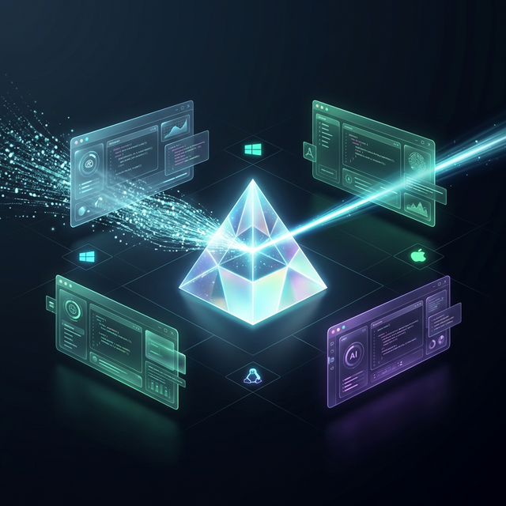

# 🚀 AI Token Optimizer (Universal)



> **Empowering Developers by Breaking the AI Context Barrier.**

[](https://opensource.org/licenses/MIT)
[](http://makeapullrequest.com)
[](https://github.com/xy23403518-hash/antigravity-token-optimizer)

[English](#english) | [中文](#中文)

---

<a name="english"></a>

## 🌍 English

### 1. Introduction & Vision

In the era of AI-native programming, **Context is Currency**. High token consumption and "context window overflow" are the primary barriers preventing individual developers from building large-scale, complex systems.

**AI Token Optimizer** is a cross-platform, multi-agent skill suite designed to solve this. Originally built for **Antigravity** and **Claude Code**, it is evolving into a universal optimization layer for **Cursor**, **Codex**, and beyond.

**The Vision**: To prove that with the right optimization strategies, individual developers can leverage AI to build projects with ecosystem-scale value, breaking through traditional technical trajectories.

### 2. ⚡ Key Features

- **✨ VFS (Virtual Function Signatures)**: Scan massive codebases with 90% fewer tokens by abstracting structure without reading full files.
- **⚡ Hybrid Context Management**: Integrated support for **Antigravity (DCP)** and **Claude Code CLI** (`/clear`, `/compact`, `.claudeignore`).
- **🛡️ Cross-OS Safety Layer**: Hardened guards and path discovery for **Windows**, **macOS**, and **Linux**.
- **🛠️ Local Tool Offloading**: Transition deterministic tasks (linting, formatting) to local runtimes, saving AI tokens for creative reasoning.
- **📦 Multi-Agent Compatibility**: Engineered to work seamlessly across different AI terminals and IDEs (Claude Code, Antigravity, Cursor).

### 3. 📦 Getting Started

#### Prerequisites

- **Git** & **GitHub CLI** (`gh`)
- **Python 3.9+** or **Node.js**
- Recommended Utilities: `fd`, `ruff`, `jq`

#### Installation

```bash
# Clone the repository
git clone https://github.com/xy23403518-hash/antigravity-token-optimizer.git
cd antigravity-token-optimizer

# Install to your Antigravity/Claude Code skill directory
# (Refer to your specific tool documentation for the skills path)
cp -r ./antigravity-token-optimizer ~/.gemini/antigravity/skills/
```

### 4. 🗺️ Roadmap

- [x] **Phase 1**: MVP Implementation & Antigravity Integration.
- [ ] **Phase 2**: Dedicated plugins for **Cursor** and **VS Code**.
- [ ] **Phase 3**: Automated "Token Audit" reports for CI/CD pipelines.
- [ ] **Phase 4**: Community-driven optimization patterns library.

---

<a name="中文"></a>

## 🇨🇳 中文

### 1. 项目简介与愿景

在 AI 原生编程时代，**上下文（Context）就是资产**。高昂的 Token 消耗和“上下文窗口溢出”是阻碍个人开发者构建大规模复杂系统的核心障碍。

**AI Token Optimizer** 是一个跨平台、多智能体的优化技能集。它最初为 **Antigravity** 和 **Claude Code** 构建，目前正演变为支持 **Cursor**、**Codex** 等主流工具的通用优化层。

**我们的愿景**：证明通过正确的优化策略，个人开发者也能利用 AI 构建具有生态价值的项目，突破传统的技术发展轨迹。

### 2. ⚡ 核心特性

- **✨ VFS (虚拟函数签名)**：通过结构抽象，以减少 90% Token 的代价完成大规模代码库扫描。
- **⚡ 混合上下文管理**：原生支持 **Antigravity (DCP)** 与 **Claude Code CLI** 优化指令（`/clear`, `/compact`, `.claudeignore`）。
- **🛡️ 跨系统安全层**：针对 **Windows**、**macOS** 和 **Linux** 的强化保护，具备自动路径转换和配置自动发现。
- **🛠️ 本地工具卸载**：将确定性任务（格式化、检查）交给本地运行环境，把 Token 留给更重要的逻辑推理。
- **📦 多端兼容性**：专为跨 AI 终端设计（Claude Code, Antigravity, Cursor），保持一致的优化体验。

### 3. 📦 快速开始

#### 环境依赖

- **Git** 与 **GitHub CLI** (`gh`)
- **Python 3.9+** 或 **Node.js**
- 推荐工具：`fd`, `ruff`, `jq`

#### 安装步骤

```bash
# 克隆仓库
git clone https://github.com/xy23403518-hash/antigravity-token-optimizer.git
cd antigravity-token-optimizer

# 安装到您的 Antigravity/Claude Code 技能目录
cp -r ./antigravity-token-optimizer ~/.gemini/antigravity/skills/
```

### 4. 🗺️ 发展路线图

- [x] **第一阶段**：MVP 实现与 Antigravity 集成。
- [ ] **第二阶段**：支持 **Cursor** 与 **VS Code** 的专项插件。
- [ ] **第三阶段**：CI/CD 流水线中的自动“Token 审计”报告。
- [ ] **第四阶段**：社区驱动的优化模式库。

---

## ✍️ Developer's Note / 开发者手记

**This project holds a special meaning to me.** It is my very first open-source endeavor, built from the ground up with the assistance of AI programming tools. It stands as a testament to how AI can democratize software creation, allowing individuals to break through traditional barriers and change their technical trajectories. I am actively maintaining and growing this project, and any support or contribution is deeply appreciated.

**这个项目对我而言具有特殊的意义。** 这是我第一个从零开始、在 AI 编程工具辅助下构建的开源项目。它证明了 AI 如何实现软件创作的平民化，让个人能够突破传统障碍，改变自己的技术轨迹。我正积极维护并完善这个项目，非常感谢任何形式的支持或贡献！

## 📄 License / 许可证

This project is licensed under the MIT License - see the [LICENSE](LICENSE) file for details.
本项目采用 MIT 许可证 - 详情请参阅 [LICENSE](LICENSE) 文件。
